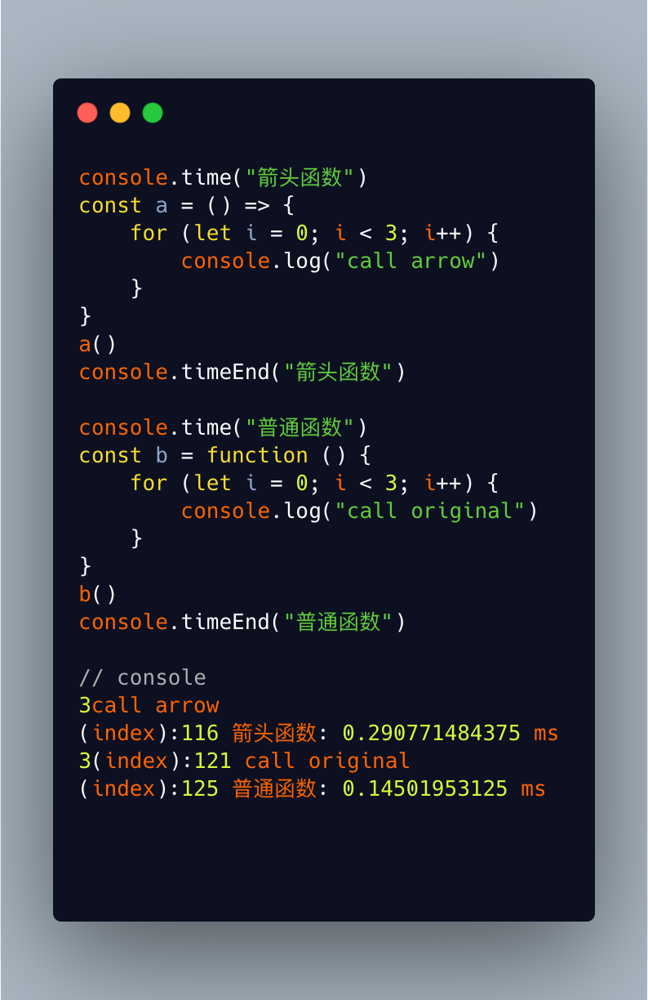

# 箭头函数和普通函数

## 前言

> 在日常开发中，箭头函数的使用率已经很高了。这里深入研究一下，箭头函数和普通函数的区别以及执行效率。

## 区别

|                               | 箭头函数 | 普通函数 |
| :---------------------------: | :------: | :------: |
|   是否有argument(实参列表)    |    否    |    是    |
| 是否能做构造函数(能否使用new) |    否    |    是    |
|     执行上下文能否被更改      |    否    |    是    |

箭头函数的this永远和父作用域的this保持一致，普通函数可以使用**call,apply,bind**修改this的指向。

## 效率

